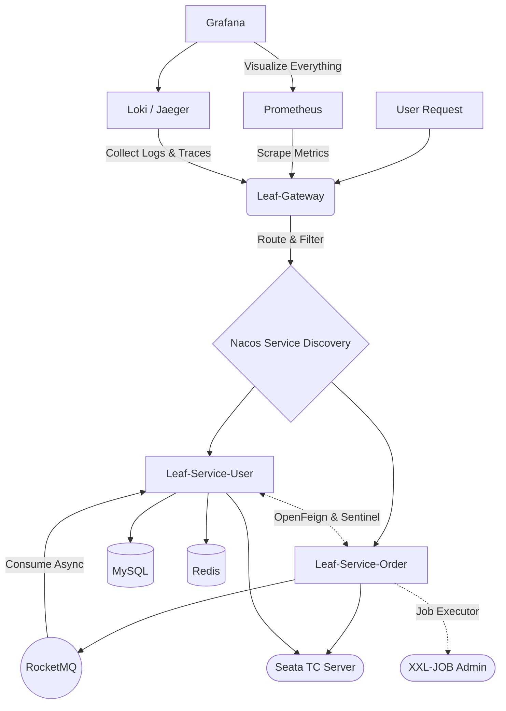

# Leaf Microservice Framework 🌱


> **Leaf SpringCloud** 是一套从零到一构建的现代化企业级微服务架构学习和实践项目。
> 
> 本项目遵循高内聚、低耦合的设计原则，通过 Spring Cloud Alibaba 生态实现了服务发现、流量治理、远程调用、消息解耦以及完善的可观测性体系，并打通了本地到云端的 DevOps (Jenkins) 全自动化流水线部署方案。

## 🎯 项目核心亮点

- ⚡️ **前沿架构选型**：全面拥抱 **JDK 21**，底层基于 `Spring Boot 3.2.x` + `Spring Cloud Alibaba 2023`，体验最新虚拟线程与生态特性。
- 🛡️ **微服务治理闭环**：以 Nacos 为双子星（配置与注册中心），OpenFeign 解决服务间痛点调用，Sentinel 作为流量防卫兵实现接口熔断与降级。
- 📦 **中间件火力全开**：集成 MySQL8、Redis 以及 RocketMQ 5 消息队列完成异步解耦和错峰流控。
- 📊 **世界级可观测大屏**：通过 Prometheus + Grafana 完成 JVM 和 Spring 指标抓取，通过 **Loki + Promtail** 实现分布式日志聚合，通过 **Jaeger** 打通全链路追踪。
- 💸 **分布式事务与调度**：集成 **Seata (AT模式)** 解决微服务跨库事务数据一致性问题，接入 **XXL-JOB** 构建分布式流式任务调度体系。
- 🛠️ **DevOps & K8s 云原生部署**：不仅提供本地 Docker Compose 极速基建起航，更包含基于 `Dockerfile` 和 `Jenkinsfile` 的自动化 CI/CD，以及直达 **Kubernetes (K8s)** 的企业级集群运维 YAML 配置与部署方案。

## 🏗️ 系统架构拓扑



## 📂 模块指南及结构

整个微服务划分为如下几个基础骨架：

| 核心模块名 | 端口 | 模块职责 |
|---|---|---|
| **[leaf-common](./leaf-common)** | - | 基础依赖包、统一常量、Result 通用响应体包装器 |
| **[leaf-gateway](./leaf-gateway)** | `8080` | 集群的统一流量网关，处理请求路由转发与鉴权 |
| **[leaf-service-user](./leaf-service-user)** | `8081` | 用户域微服务 (包含 MyBatis-Plus 与 Redis 缓存整合实践) |
| **[leaf-service-order](./leaf-service-order)** | `8082` | 订单域微服务 (验证 OpenFeign RPC 及 RocketMQ 异步投递) |

## 🚀 极速起航 (Quick Start)

### 1. 基础环境搭建
系统根目录下的 `infra-deploy` 目录为您准备了一套完整的 Docker Compose 配置文件与 K8s 集群部署脚本：
```bash
cd infra-deploy
# 在本地直接拉起 Nacos, MySQL, Redis, RocketMQ, Prometheus, Grafana, Loki, Jaeger, Seata, XXL-JOB 等全套基座
docker compose up -d
```
> *注：MySQL 脚本已经自动挂载并导入了所有必要的微服务、Seata 和 XXL-JOB 初始化建库语句设置。*

### 2. 本地项目启动开发
由于引入了 JDK21，请确保您的 IDE (如 IntelliJ IDEA) 设置 JDK 版本为 21。
按以下次序启动核心主程序：
1. `GatewayApplication`
2. `UserApplication`
3. `OrderApplication`

访问测试接口：
```text
网关直接访问订单层出单 (自动 RPC 调用的验证)
GET http://localhost:8080/api/order/create/1
```

### 3. 可视化监控探活导航
启动后，您可以通过以下地址访问我们的云原生监控与管理大盘：
- **Nacos 控制台**: [http://127.0.0.1:8848/nacos](http://127.0.0.1:8848/nacos) *(nacos/nacos)*
- **Sentinel Dashboard**: [http://127.0.0.1:8080](http://127.0.0.1:8080) (如果已单独起服务)
- **XXL-JOB 调度中心**: [http://127.0.0.1:8088/xxl-job-admin](http://127.0.0.1:8088/xxl-job-admin) *(admin/123456)*
- **Jaeger 链路追踪 UI**: [http://127.0.0.1:16686](http://127.0.0.1:16686)
- **Grafana (聚合 Metrics/Logs)**: [http://127.0.0.1:3000](http://127.0.0.1:3000) *(admin/admin)*

## � 项目开发任务路线图
为了记录并指引我们的开发学习历程，我们规划详细的演进 Roadmap（正在向集群高可用迈进）：
> �💡 强烈建议阅读：[Spring Cloud Alibaba 演进与 K8s 部署路线图 (task.md)](./docs/task.md)

## 💡 技术栈清单 (Tech Stack)

* **语言**: Java >= 21
* **核心框架**: Spring Boot 3.2.11 / Spring Cloud 2023.0.1
* **注册/配置中心**: Alibaba Nacos 2.3.0
* **API 网关**: Spring Cloud Gateway
* **远程过程调用 & 服务降级**: OpenFeign / Alibaba Sentinel
* **持久层 & 分库中间件**: MySQL 8 / MyBatis-Plus 3.5.5
* **缓存层**: Redis 7
* **消息队列**: Apache RocketMQ 5.1.4
* **分布式事务**: Alibaba Seata 2.0.0 (AT Mode)
* **分布式任务调度**: XXL-JOB 2.4.1
* **可观测性 (Metrics/Tracing/Logging)**: Micrometer / Prometheus / Jaeger / Loki+Promtail / Grafana
* **容器化运维 & CI/CD**: Docker Compose / Kubernetes (K8s) / Jenkins

## 📌 进阶笔记与避坑指南
对于 CI/CD 构建部分以及网络抓取排坑史，我们在开发历程中特意总结了一篇专属小册子：
> 详见 [Jenkins 本地/离线环境与踩坑指北 (jenkins_troubleshooting.md)](./docs/jenkins_troubleshooting.md)

---
*Created by [Paiky](https://github.com/paiky) together with Antigravity AI Code Assistant.*
